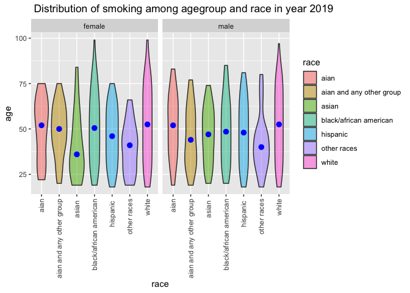
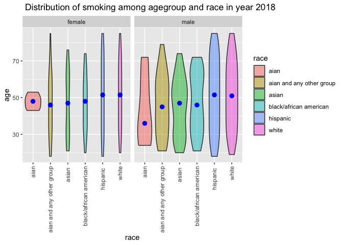
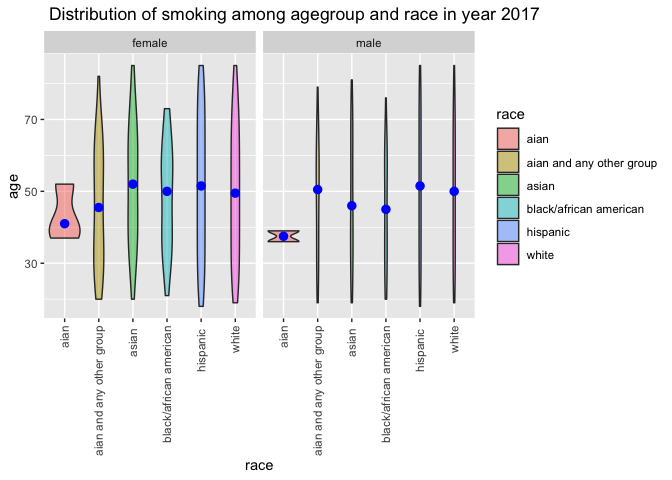

tidy data
================

``` r
library(tidyverse)
library(readxl)
library(dplyr)
library(ggplot2)
```

## Tidy Data

``` r
#load data set
smoke_df_2020 =read_csv("data/adult20.csv")
```

    ## Warning: One or more parsing issues, see `problems()` for details

    ## Rows: 31568 Columns: 618

    ## ── Column specification ────────────────────────────────────────────────────────
    ## Delimiter: ","
    ## chr   (1): HHX
    ## dbl (606): URBRRL, RATCAT_A, INCGRP_A, INCTCFLG_A, FAMINCTC_A, IMPINCFLG_A, ...
    ## lgl  (11): OGFLG_A, OPFLG_A, CHFLG_A, PRPLCOV2_C_A, STOMAAGETC_A, RECTUAGETC...

    ## 
    ## ℹ Use `spec()` to retrieve the full column specification for this data.
    ## ℹ Specify the column types or set `show_col_types = FALSE` to quiet this message.

``` r
smoke_df_2019 =read_csv("data/adult19.csv")
```

    ## Warning: One or more parsing issues, see `problems()` for details

    ## Rows: 31997 Columns: 534

    ## ── Column specification ────────────────────────────────────────────────────────
    ## Delimiter: ","
    ## chr   (1): HHX
    ## dbl (515): URBRRL, RATCAT_A, INCGRP_A, INCTCFLG_A, FAMINCTC_A, IMPINCFLG_A, ...
    ## lgl  (18): OGFLG_A, OPFLG_A, CHFLG_A, MAFLG_A, PRPLCOV2_C_A, RECTUAGETC_A, O...

    ## 
    ## ℹ Use `spec()` to retrieve the full column specification for this data.
    ## ℹ Specify the column types or set `show_col_types = FALSE` to quiet this message.

``` r
smoke_df_2018 =read_csv("data/adult18.csv")
```

    ## Warning: One or more parsing issues, see `problems()` for details

    ## Rows: 25417 Columns: 742

    ## ── Column specification ────────────────────────────────────────────────────────
    ## Delimiter: ","
    ## chr   (3): FPX, FMX, HHX
    ## dbl (699): INTV_QRT, WTIA_SA, WTFA_SA, SEX, HISPAN_I, R_MARITL, MRACRPI2, RA...
    ## lgl  (40): AASAGE16, CANAGE3, CANAGE4, CANAGE8, CANAGE11, CANAGE17, CANAGE19...

    ## 
    ## ℹ Use `spec()` to retrieve the full column specification for this data.
    ## ℹ Specify the column types or set `show_col_types = FALSE` to quiet this message.

``` r
smoke_df_2017 =read_csv("data/adult17.csv")
```

    ## Warning: One or more parsing issues, see `problems()` for details

    ## Rows: 26742 Columns: 702

    ## ── Column specification ────────────────────────────────────────────────────────
    ## Delimiter: ","
    ## chr   (3): FPX, FMX, HHX
    ## dbl (678): INTV_QRT, WTIA_SA, WTFA_SA, SEX, HISPAN_I, R_MARITL, MRACRPI2, RA...
    ## lgl  (21): CANAGE4, CANAGE9, CANAGE13, CANAGE14, CANAGE17, CANAGE24, ALCHRC2...

    ## 
    ## ℹ Use `spec()` to retrieve the full column specification for this data.
    ## ℹ Specify the column types or set `show_col_types = FALSE` to quiet this message.

``` r
smoke_df_2016 =read_csv("data/adult16.csv")
```

    ## Warning: One or more parsing issues, see `problems()` for details

    ## Rows: 11107 Columns: 206

    ## ── Column specification ────────────────────────────────────────────────────────
    ## Delimiter: ","
    ## chr   (4): FPX, FMX, HHX, CSRESPNO
    ## dbl (200): INTV_QRT, SEX, HISPAN_I, MRACRPI2, RACERPI2, MRACBPI2, AGE_P, REC...
    ## lgl   (2): AMR1RN, AODD1N

    ## 
    ## ℹ Use `spec()` to retrieve the full column specification for this data.
    ## ℹ Specify the column types or set `show_col_types = FALSE` to quiet this message.

``` r
clean_df = smoke_df_2020 %>% 
  #clean variable names
  janitor::clean_names()
```

#The smoking trend in the US over 5 years let’s clean the dataset for
observing the smoking trends in these five years lets select the
relavant questions first and the following explain the details of the
variables smoking_status: current smoking stastus.

``` r
#cleaning data for 2019 and 2020 
cleaning_for_smoke_trend= function(dataset){
  dataset%>% 
  janitor::clean_names()%>% 
  select(cignow_a, smkcigst_a,sex_a,hispallp_a, agep_a)%>% 
  rename(smoke_freq = cignow_a ,  smoking_status = smkcigst_a, sex = sex_a,race =hispallp_a , age =  agep_a)}
#select(cignow_a, smkcigst_a,smkage_a)
#reminder for later: smoking_age =smkage_a 
smoke_trend_2020 = cleaning_for_smoke_trend(smoke_df_2020)
smoke_trend_2019  = cleaning_for_smoke_trend(smoke_df_2019)

#cleaning data for 2018, 2017,2016 
#rewrite the function since they have a different variable code
cleaning_for_smoke_trend_2 = function(dataset){
  dataset%>% 
  janitor::clean_names()%>% 
  select(smkstat2,sex, age_p, racerpi2)%>% 
  rename(smoking_status =smkstat2, age = age_p, race= racerpi2)}

smoke_trend_2018 = cleaning_for_smoke_trend_2(smoke_df_2018)
smoke_trend_2017 = cleaning_for_smoke_trend_2(smoke_df_2017)
```

the number of people smoking

``` r
 finding_smoking_trend = function(dataframe){
   dataframe %>% 
  select(smoking_status)%>%
  mutate(smoking_status = recode(smoking_status,"1" = "current every day smoker", "2" ="current some day smoker",  "3"= "former smoker","4" = "never smoker"))%>% 
  count(smoking_status)%>%
  drop_na()}

#apply the function to know the summary of smoking status 
#can i use a map function here?
#have to add year and undergo pivot_longer
#problem encountered: temporarily there is no data available in 2016
smoke_trend_20 = smoke_trend_2020 %>% 
  finding_smoking_trend()%>%
  mutate(year =  "2020")
```

    ## Warning: Unreplaced values treated as NA as .x is not compatible. Please specify
    ## replacements exhaustively or supply .default

``` r
smoke_trend_19 = smoke_trend_2019 %>% 
  finding_smoking_trend()%>%
  mutate(year =  "2019")
```

    ## Warning: Unreplaced values treated as NA as .x is not compatible. Please specify
    ## replacements exhaustively or supply .default

``` r
 smoke_trend_18= smoke_trend_2018 %>% 
  finding_smoking_trend()%>%
  mutate(year =  "2018")
```

    ## Warning: Unreplaced values treated as NA as .x is not compatible. Please specify
    ## replacements exhaustively or supply .default

``` r
smoke_trend_17 = smoke_trend_2017 %>% 
  finding_smoking_trend()%>%
  mutate(year =  "2017")
```

    ## Warning: Unreplaced values treated as NA as .x is not compatible. Please specify
    ## replacements exhaustively or supply .default

``` r
smoke_trend_overall = bind_rows(smoke_trend_17,smoke_trend_18,smoke_trend_19,smoke_trend_20)%>%
  rename(ppl_sum = n)%>%
  relocate(year)

#lets create a ggpplot
# ***task： try it to make it interactive soon....
#Problem: Should I use rate instead....???
smoke_trend_overall %>% 
  ggplot(aes(x = year, y = ppl_sum, group = smoking_status)) + 
  geom_point(aes(color = smoking_status))+ geom_line(aes(color = smoking_status))+ 
 ggtitle("Overall smoking trend of the U.S in recent 4 years according to NHIS ")+
  labs(y = "sum of people")
```

<!-- -->

``` r
#ggplotly(smoke_trend_overall_plot)
```

After knowing the overall trend… let’s observe the distribution of
smoking. In order to know their distribution, we have to obtain the
information of their age, race and sex. We can group by these categories
and making a distribution plot.

``` r
#function creating the same table to find the distribution
#first do some data cleaning
 finding_smoking_dis =  function(dataframe){
   dataframe %>% 
  select(smoking_status, race, age, sex)%>%
  filter(sex== "1" | sex== "2")%>%
  subset(race != "97"|race != "98"|race != "99") %>% 
  mutate(sex = recode(sex,"1" = "male", "2" ="female"), 
         race =recode(race, "1" = "hispanic ", "2" ="white" , "3"="black/african american", "4"= "asian ", "5" = "aian", "6" = "aian and any other group", "7" ="other races"),
         #since 1,2 represents current daily/occasional smokers whereas 3,4 is former smoker and never smoke respectively; we define 1,2 as smoker whereas 3,4 as non-smoker
         smoking_status = 
           case_when(smoking_status == "1"|smoking_status == "2"~ "smoker",
                     smoking_status == "3"|smoking_status == "4"~ "non-smoker"))}

df1= finding_smoking_dis(smoke_trend_2020)%>%
  mutate(year =  "2020")
df2 = finding_smoking_dis(smoke_trend_2019)%>%
  mutate(year =  "2019")
df3= finding_smoking_dis(smoke_trend_2018)%>%
  mutate(year =  "2018")
df4 = finding_smoking_dis(smoke_trend_2017)%>%
  mutate(year =  "2017")


#***making interactive plot with option clicking on different years 
#year 2020 smoking distribution
df1%>%
filter(smoking_status =="smoker")%>%
  count(race,age,sex)%>%
  ggplot(aes(x =race, y =age,)) + 
  geom_violin(aes(fill = race), alpha = .5) + 
  stat_summary(fun = "median", color = "blue")+facet_grid(.~sex)+ 
  labs(title=" Distribution of smoking among agegroup and race in year 2020")+ 
  theme(axis.text.x = element_text(angle = 90, vjust = 0.5, hjust=1))
```

    ## Warning: Removed 7 rows containing missing values (geom_segment).

    ## Warning: Removed 7 rows containing missing values (geom_segment).

<!-- -->

``` r
df2%>%
filter(smoking_status =="smoker")%>%
  count(race,age,sex)%>%
  ggplot(aes(x =race, y =age)) + 
  geom_violin(aes(fill = race), alpha = .5) + 
  stat_summary(fun = "median", color = "blue")+ facet_grid(.~sex)+ 
  labs(title=" Distribution of smoking among agegroup and race in year 2019") + theme(axis.text.x = element_text(angle = 90, vjust = 0.5, hjust=1))
```

    ## Warning: Removed 7 rows containing missing values (geom_segment).

    ## Warning: Removed 7 rows containing missing values (geom_segment).

<!-- -->

``` r
df3%>%
filter(smoking_status =="smoker")%>%
  count(race,age,sex)%>%
  ggplot(aes(x =race, y =age)) + 
  geom_violin(aes(fill = race), alpha = .5) + 
  stat_summary(fun = "median", color = "blue")+
   facet_grid(.~sex)+ 
  labs(title=" Distribution of smoking among agegroup and race in year 2018") + theme(axis.text.x = element_text(angle = 90, vjust = 0.5, hjust=1))
```

    ## Warning: Removed 6 rows containing missing values (geom_segment).

    ## Warning: Removed 6 rows containing missing values (geom_segment).

<!-- -->

``` r
df4%>%
  filter(smoking_status =="smoker")%>%
  count(race,age,sex)%>%
  ggplot(aes(x =race, y =age)) + 
  geom_violin(aes(fill = race), alpha = .5) + 
  stat_summary(fun = "median", color = "blue")+
  facet_grid(.~sex)+ labs(title=" Distribution of smoking among agegroup and race in year 2017") + theme(axis.text.x = element_text(angle = 90, vjust = 0.5, hjust=1))
```

    ## Warning: Removed 6 rows containing missing values (geom_segment).

    ## Warning: Removed 6 rows containing missing values (geom_segment).

<!-- -->

``` r
#make plotly in html
#ggplotly(plot_df4)
#ggplotly(plot_df3)
#ggplotly(plot_df2)
#ggplotly(plot_df1)
```
